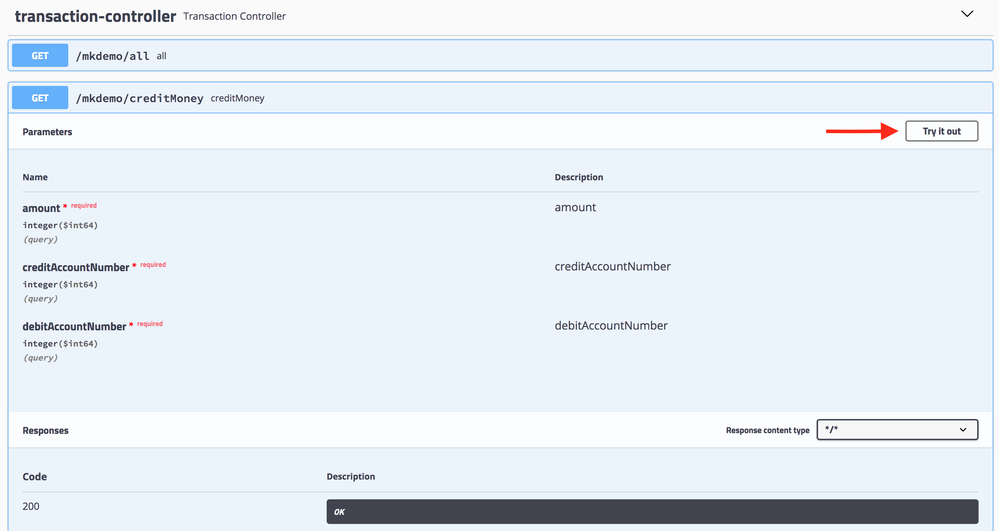

# Test Assignment 

Simple banking money transaction application

## Getting Started

These instructions will get you a copy of the project up and running on your local machine for testing purposes

### Prerequisites

What things you need to install

```
MySQL 5.7 or higher
```

### Installing

Download or Clone project from GitHub. Open preferably on an IDEA

Compile and install all packages needed locally through maven on terminal:

```
mvn clean install
```

## Running the application

There are two predefined accounts stored in a local database when starting the application :

```
| account_id    | account_number | balance | 
| ------------- | -------------  |-------- |
|       1       |    18395627    |  25000  | 
|       2       |    13902143    |  12000  |
```

Use this data as input to test the application through the exposed APIs

Run Spring Boot Application and go to :

```
http://localhost:8080/swagger-ui.html
```

Use Swagger UI console to subscribe and test the APIs using the predefined accounts' information

On the Transaction Controller there are three endpoints:

* Credit money from one account to another
* Retrieve transactions history for and account
* Retrieve all transactions peerformed

Try the APIs by pressing "Try it out" button as displayed on the screenshot below:



Execute the API call after filling all required parameters by pressing Execute button:


You need first to perform a transaction by calling ```/mkdemo/creditMoney``` API in order to populate transactions table to test the rest services


